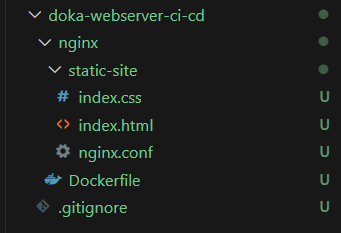
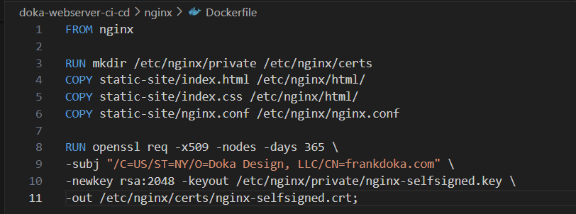
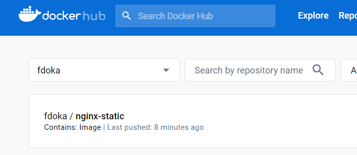

# NGINX, OpenSSL, and the Static Site in Docker

Objective: To bundle the static website with NGINX and OpenSSL inside a Docker container, preparing it for deployment.

## **Setting Up NGINX with OpenSSL in Docker**

1. **Project Initialization**: Setting up directories for the NGINX and the required files. 

   
2. **Static Web Content**: The simple static webpage is created using HTML and CSS. Focus remains on the containerization process rather than front-end design, so the project makes use of a basic index page and css for deployment.

3. **Configuring NGINX**: Configure NGINX to serve the static site, with added configurations for SSL using OpenSSL. The basic configuration can be found here: 

4. **Docker Integration**: A Dockerfile, which details how the container should be built, is crafted. This file instructs Docker to set up NGINX and incorporate our self-signed SSL certificate. The Docker image is created which encapsulates the web server and configuration.

5. **Pushing the Docker Image**: The Dockerfile is pushed to the repo.

## **Conclusion**

At this stage, I have successfully containerized the static website using Docker. With NGINX as the web server and OpenSSL providing SSL functionalities, the site is ready for the upcomming stages. In the next phase, Terraform will be used to create the EC2 instance which will host the Docker container.
