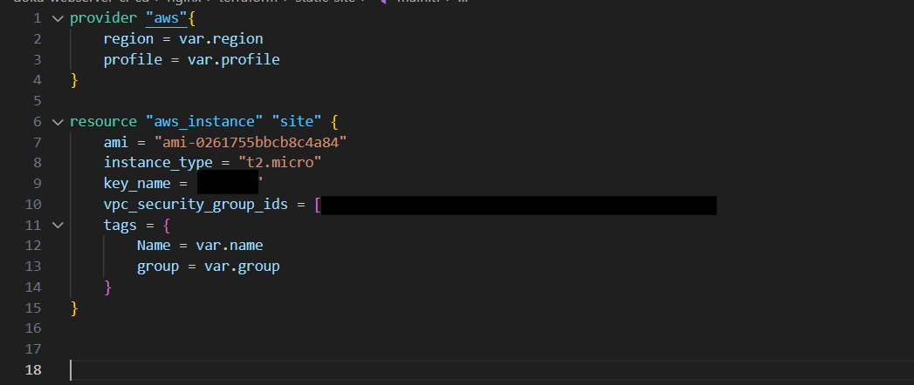

# Infrastructure as Code with Terraform

Objective: To make use of Terraform's Infrastructure as Code (IaC) capabilities to create the necessary AWS infrastructure, providing a foundation for deploying the Docker-contained NGINX web server on AWS.

## **Terraform Configuration**

Terraform offers a systematic and script-driven approach to manage and provision cloud resources. The configuration will primarily focus on deploying an EC2 instance configured specifically for this project. I will be using variable names and collaborating with Ansibile and Dynamic Inventory to further automate the configuration in a future phase.

1. **Setting Up Terraform**: Create a main.tf and a variables.tf to hold the Terraform configuration information. Since a limited amount of resources are being used, all definitions can be placed in our main.tf.

I will use the variables.tf file to connect our project with the Ansibile Dynamic Inventory.

## **Conclusion**

With the use of Terraform the infrastructure setup has been streamlined, ensuring consistency and reproducibility. With AWS resources now in place, it is time to look towards Ansible and Dynamic Inventory for configuration management.