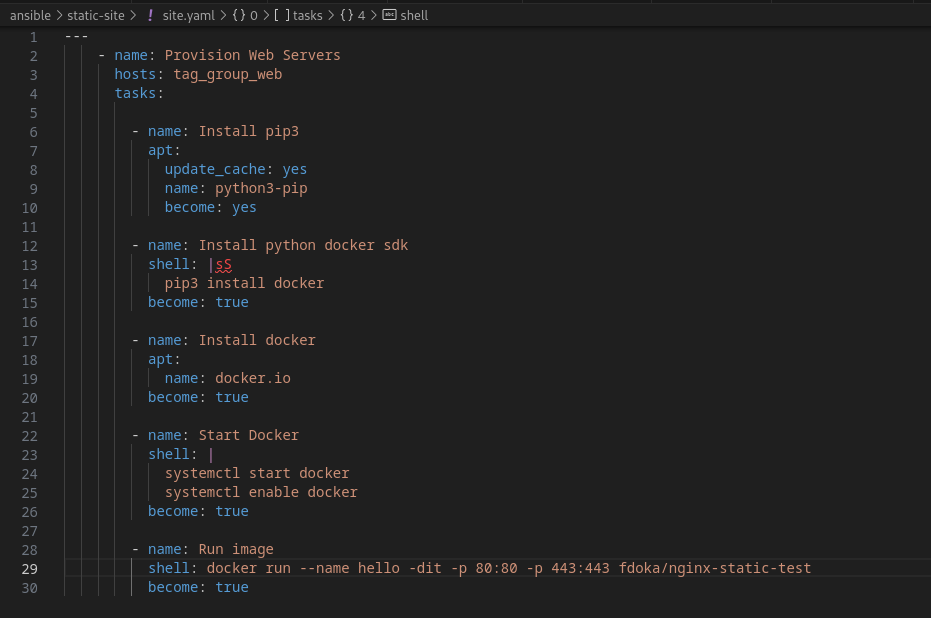

# Ansible and Dynamic Inventory

Objective: To implement Ansible for automated configuration management and orchestration. Using playbooks to carry tasks on the server and using dynamic inventory for efficient AWS EC2 management

## **Understanding Ansible and Dynamic Inventory**

Ansible is an open-source tool that offers automation for application deployment, configuration management, and task orchestration. This tool employs a declarative language, characterizing system configurations through playbooks. 

Dynamic Inventory empowers Ansible to obtain real-time data about the infrastructure, ensuring the most recent information is used when executing playbooks.

1. **Writing Playbooks**: Define the tasks Ansible should carry out on the AWS EC2 instances. Tasks may vary from establishing software packages, configuring system settings, to deploying the Docker-contained NGINX web server.

3. **Running Playbooks**: Upon executing the playbooks against the AWS EC2 instances, Ansible communicates with them, ensuring they match the configurations detailed in the playbooks.

## **Conclusion**

With Ansible and Dynamic Inventory combined, an efficient and automated configuration management system is achieved. AWS EC2 instances are now appropriately set, ready for the subsequent phase: Automated Deployments with Jenkins Pipeline.
