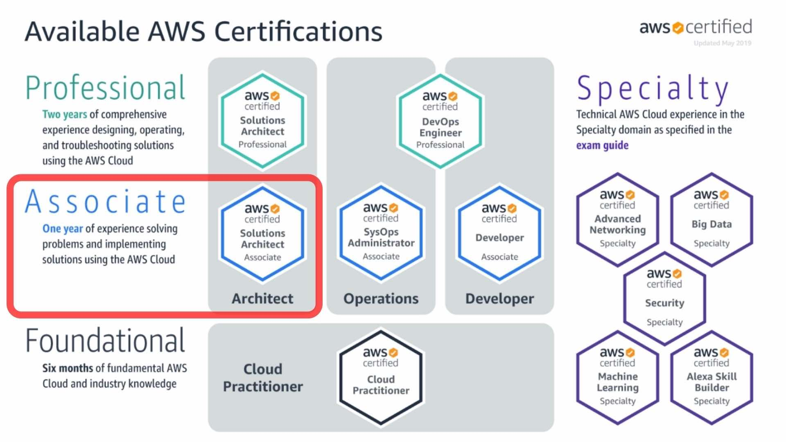

# Credentials
### 🔗 [Credly Badge](https://www.credly.com/badges/c13f0728-57ac-4e67-9644-ca9f310a135d/public_url)

# Introduction
I passed SAA-C03 - AWS Solutions Architect - Associate certification exam.

# Certification Information
As Cloud Computing continues to ascend, businesses are in a constant state of transition, moving away from traditional on-premise infrastructure towards the cloud. This migration brings a wealth of advantages, primarily in terms of scalability and resilience when confronted with unexpected disasters.

The AWS **Solutions Architect - Associate** certification stands as a testament to your proficiency in crafting and deploying meticulously planned solutions within the AWS ecosystem, currently the foremost cloud provider in the industry. In essence, this examination gauges your aptitude for conceiving architectural designs tailored to specific scenarios. To illustrate, consider a scenario where a company desires the uninterrupted operation of its application, even in the face of a catastrophic event causing an entire AWS region to become inoperable. In this context, how would you strategically structure their infrastructure to meet this exigent requirement?

# Exam Format
In this examination, you will encounter a total of **65 questions** and have a time allotment of **130 minutes** to respond to them. This equates to an average of **2 minutes per question** for you to carefully consider and answer. Your evaluation will be established on a percentile scale that spans from 100 to 1000, with a requisite score of **over 720 to attain a passing grade**. With this information in mind, you can deduce that achieving approximately **72% accuracy in your responses is essential for success**. For a more comprehensive understanding of the scoring system, you can consult this informative [link](https://aws.amazon.com/blogs/training-and-certification/demystifying-your-aws-certification-exam-score/).

This examination operates under a binary pass/fail criterion. Should you successfully pass the exam, the specific score achieved will have no substantial bearing. Your score will merely be included in your score report for personal reference, without appearing on the official certificate.

The examination fee for this assessment is set at $150 USD.

# Prep Strategy for SAA-C03 Exam

1. **Exam Blueprint Understanding:** Begin by thoroughly reviewing the official [AWS Certified Solutions Architect - Associate exam guide](https://aws.amazon.com/certification/certified-solutions-architect-associate/) to understand key domains.

2. **Study Plan:** Create a flexible study schedule allocating time for courses, practice exams, hands-on labs, and revision.

3. **Online Resources:** Enroll in reputable online courses tailored for the SAA-C03 exam. Popular platforms like [AWS Training](https://www.aws.training/) and [A Cloud Guru](https://acloud.guru/) offer comprehensive video courses.

4. **Hands-On Practice:** Use a free [AWS Free Tier](https://aws.amazon.com/free/) account to gain practical experience deploying AWS services and solutions.

5. **Practice Exams:** Take official AWS practice exams, available on the [AWS Training website](https://www.aws.training/Certification?src=exam-prep).

6. **Community Engagement:** Join AWS forums, such as the [AWS Developer Forums](https://forums.aws.amazon.com/index.jspa).

7. **Regular Review:** Periodically revisit study materials to reinforce your understanding, focusing on weaker areas.

8. **Exam Simulation:** Simulate the exam environment with timed practice exams as your exam date approaches.

9. **Identify Weaknesses:** Analyze practice exam results to pinpoint areas needing improvement.

10. **Exam Logistics:** Familiarize yourself with exam details and arrive early on the exam day with proper identification.

11. **Post-Exam Analysis:** Regardless of the outcome, review areas of difficulty for future improvement.

12. **Continuous Learning:** Stay updated with AWS announcements through the [AWS Blog](https://aws.amazon.com/blogs/), [AWS What's New](https://aws.amazon.com/new/), and consider advanced AWS certifications after achieving SAA-C03.

