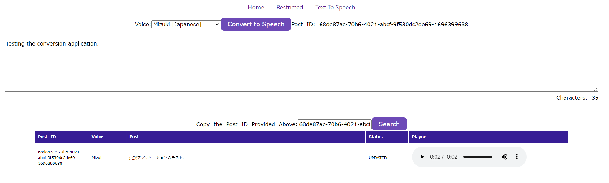
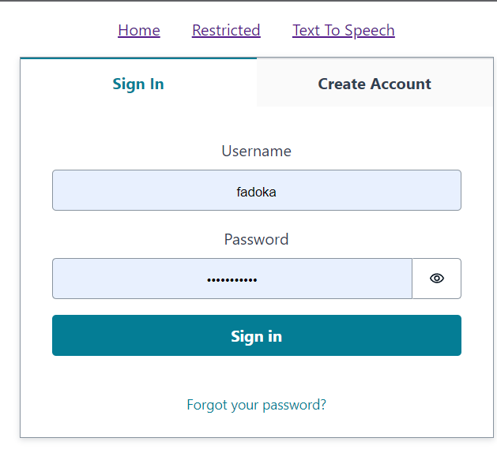
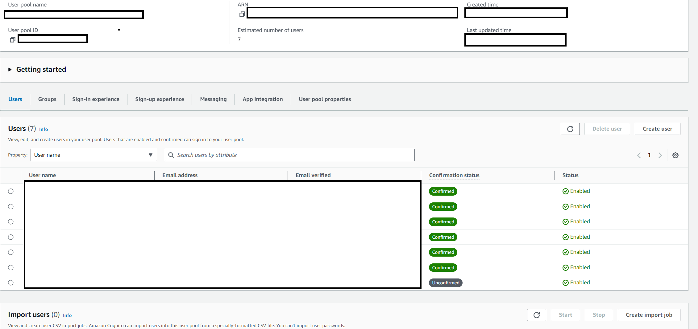

# Phase 1: Creating Initial Frontend and Login System

In this initial phase, I will lay the groundwork by creating the frontend and implementing a secure login system.

## Setting the Stage

Before we dive into the technical details, let's understand the importance of Phase 1. The frontend and user authentication system are the face and gateway to our application. A user-friendly interface and robust security are essential for a successful project.

## Building the Login System

To create a secure login system, I turned to [Amazon Cognito](https://aws.amazon.com/cognito/), a comprehensive service that handles user authentication and authorization. With Cognito, we could seamlessly integrate user sign-up, sign-in, and token-based authentication into our application.

### User Authentication

I implemented a Login system frontend UI component using [React](https://reactjs.org/), a versatile and popular JavaScript library for building user interfaces. React, combined with [AWS Amplify](https://aws.amazon.com/amplify/), allowed me to create a smooth and interactive user experience.

### Secure Backend

On the backend, Amazon Cognito ensures that user credentials are securely stored and validated. Only authorized users with valid JWT tokens can access the application's resources, providing a robust security layer.

## Data Input and Submission

The frontend components also include a feature that allows users to input text, select their desired language from a dropdown, and submit the data. This text submission is a fundamental aspect of the Text to Speech Translator, and Phase 1 sets the stage for the text translation and audio conversion processes in the upcoming phases.

## What's Next?

With Phase 1 successfully completed, the application now has a solid foundation. Users can securely log in, and I laid the groundwork for handling user input.

