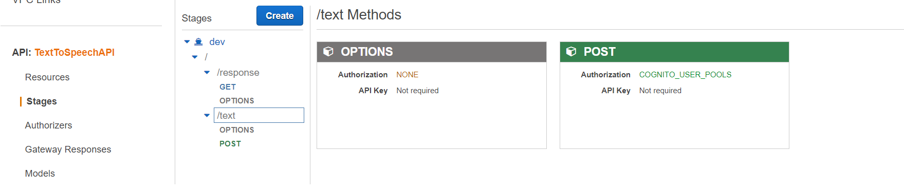
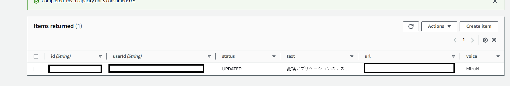

# Phase 2: Initial Serverless Application - Uploading User Input and Database Storage

In this phase, I dive deep into the development of the initial serverless application. I explore how to handle user input, securely store data, and set the stage for translation and conversion.

## Building the Data Flow

To make the Text to Speech Translator truly functional, I needed a robust backend to process user input and store the data. This is where [Amazon API Gateway](https://aws.amazon.com/api-gateway/) and [AWS Lambda](https://aws.amazon.com/lambda/) come into play.

### API Gateway Integration

I started by creating an API Gateway to handle incoming requests from our frontend. When a user submits text for translation, the POST request is sent to the API Gateway. But how do we ensure only authorized users can access our APIs?

Enter [Amazon Cognito](https://aws.amazon.com/cognito/) from Phase 1. The API Gateway is integrated with the Cognito user pool, ensuring that only users with valid JWT tokens can access our endpoints. Security is paramount!

### Lambda Functions

Once the API Gateway receives user input, it triggers AWS Lambda functions. These serverless functions process the incoming data, including the user's text, user ID, language selection, and more. Lambda is incredibly powerful for this purpose, as it can scale automatically to handle varying workloads.

### Data Storage in DynamoDB

I needed a reliable and scalable database to store user-related data, and [Amazon DynamoDB](https://aws.amazon.com/dynamodb/) fits the bill. In DynamoDB, crucial information is stored such as user IDs, submitted text, translation status, and the S3 media location where the audio files will be stored.

### Notifications with SNS

To keep the system responsive, we set up [Amazon Simple Notification Service (SNS)](https://aws.amazon.com/sns/). SNS allows us to create a topic that makes a notification when a user makes a new entry. A Lambda function is subscribed to this topic, ensuring timely processing of new user submissions.

## Progressing Toward Our Goal

With Phase 2 completed, the serverless backend is ready to receive user input, process it securely, and store it in DynamoDB. The foundation for text translation and audio conversion has been built, which will be the focus of the upcoming phases.