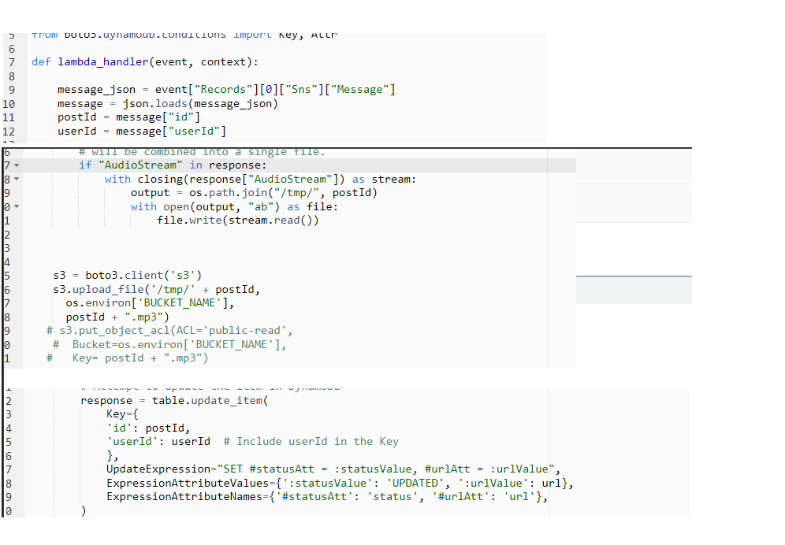

# Phase 3: Integrating Backend Database with AWS Polly and S3 for Storage of Media Files

In this phase, I'll provide you with an in-depth look into the intricacies of transforming text into speech and my robust audio file storage system.

## The Art of Speech Synthesis

Building upon the foundation laid in Phase 2, I'm diving headfirst into the world of text-to-speech transformation, leveraging the power of [Amazon Polly](https://aws.amazon.com/polly/), Amazon's Text-to-Speech (TTS) service.

### Lambda Function Subscriptions

At the heart of my text-to-speech conversion process lies a Lambda function that subscribes to the [Amazon Simple Notification Service (SNS)](https://aws.amazon.com/sns/), a component established in Phase 2. This Lambda function receives notifications whenever a new text entry is submitted, thereby initiating the speech synthesis operation.

### Language Translation with Amazon Translate

Before invoking Amazon Polly, my Lambda function undertakes a crucial task: ensuring that the user's text is translated into their preferred language using [Amazon Translate](https://aws.amazon.com/translate/). This step is pivotal in guaranteeing that the resulting speech output aligns with the user's language choice.

### Unleashing Amazon Polly's Potential

[Amazon Polly](https://aws.amazon.com/polly/) is the linchpin of my text-to-speech conversion. With Polly, I can generate highly realistic speech from translated text. Polly offers a wealth of voices and customization options, enabling precise tailoring of the voice output to cater to each user's unique preferences.

### Robust Audio Storage in Amazon S3

Once the transformation from text to speech is complete, I require a dependable repository for storing my audio files. [Amazon S3](https://aws.amazon.com/s3/) emerges as the ideal solution. Each audio file finds its dedicated home within an S3 bucket, meticulously organized based on user ID and timestamp. This structure ensures not only easy access but also impeccable file organization.

### DynamoDB Updates for Seamless Retrieval

To ensure effortless retrieval of translated text and corresponding audio by our users, I consistently update my [Amazon DynamoDB](https://aws.amazon.com/dynamodb/) entries with the necessary S3 file links. This synchronization ensures a seamless user experience, as users can promptly access their desired content.

## The User-Centric Experience Takes Shape

With Phase 3 now complete, my Text to Speech Translator possesses the remarkable capability to convert text submissions into spoken words flawlessly. Users can confidently anticipate receiving audio files that precisely align with their selected language, all thanks to the robust capabilities of Amazon Polly.