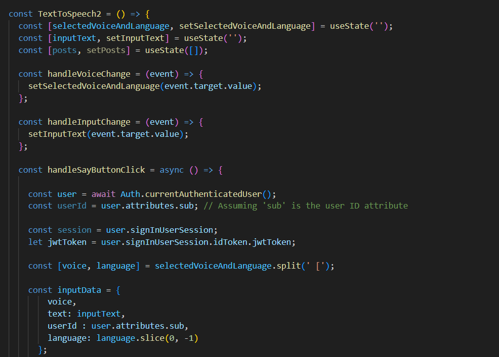

# Phase 4: Putting It All Together

In this phase, I'll focus on creating a seamless user experience by bringing all the components together.

## Retrieving Processed Information

One of the key functionalities I'll develop in this phase is a Lambda function responsible for retrieving processed information and returning it to the user. This function acts as a bridge between the backend and the frontend, ensuring that users can easily access their translated text and audio files.

### Lambda Function for Data Retrieval

My Lambda function takes user input, specifically their unique identifier (user ID), and retrieves the requested data from my backend resources. It's essential to ensure proper authorization and data security at this stage.

## Enhancing the Frontend

A user-friendly frontend is crucial for any application. In this phase, I'll modify the frontend code to accommodate data submission and retrieval seamlessly.

### Data Submission

I'll enhance the data submission process by connecting the frontend to my API Gateway. Users will be able to input text, choose their desired language, and submit the data effortlessly. The proper authorization mechanisms, including token authentication with Amazon Cognito, will be in place to ensure data security.

### Data Retrieval

On the other side of the user experience, I'll provide a straightforward method for users to retrieve their translated text and audio files. Users will receive a unique user ID, and with this ID, they can initiate data retrieval with a click of a button.

## Enabling User Interaction

Phase 4 is all about making my Text to Speech Translator user-friendly. By developing the Lambda function for data retrieval and enhancing the frontend, I'll ensure that users have a smooth and hassle-free experience.