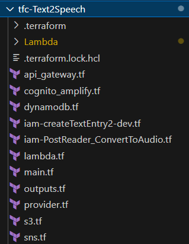
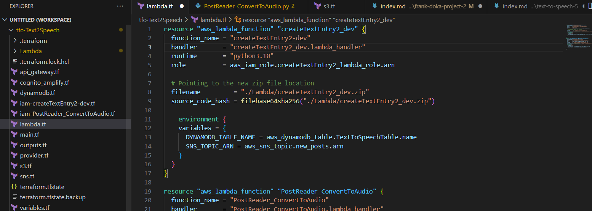
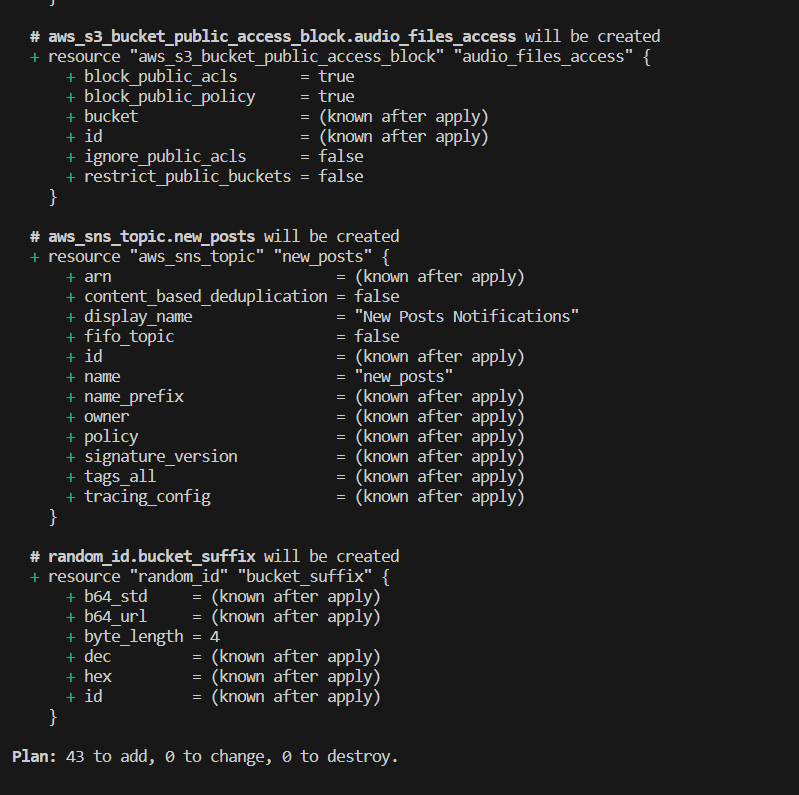
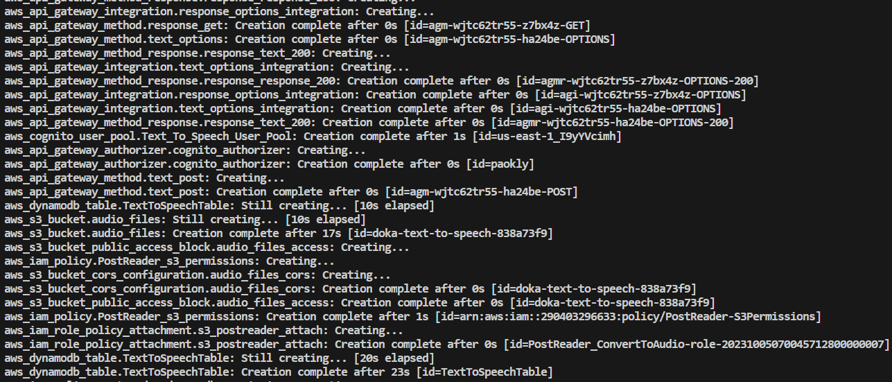
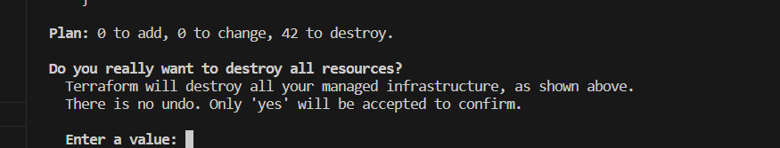

# Phase 5: Using Infrastructure as Code (IaC) to Streamline Application

In Phase 4, I successfully put all the components together, creating a seamless user experience. Now, in Phase 5, I'll focus on further optimizing my application by transitioning my backend resources to Infrastructure as Code (IaC) using Terraform.

## Streamlining Deployment and Management

One of the key advantages of Infrastructure as Code is its ability to streamline the deployment and management of cloud resources. With Terraform, I can define my AWS infrastructure in code, making it easier to version, reproduce, and scale.

### Key Benefits of IaC with Terraform

- **Reproducibility**: I can easily recreate my entire AWS infrastructure in a consistent and predictable manner. This is invaluable for scaling my application as needed.

- **Version Control**: My infrastructure code can be versioned, allowing me to track changes and collaborate with team members if needed.

- **Scalability**: With Terraform, I can quickly scale my resources up or down to meet the demands of my application without manual intervention.

- **Cost Efficiency**: IaC helps me optimize resource provisioning, ensuring I only use what I need, which can lead to a large sum of cost savings.

## Transitioning to Terraform

In this phase, I'll start by defining my AWS resources, such as Lambda functions, API Gateway, DynamoDB tables, and more, using Terraform's declarative syntax. I'll create Terraform configuration files that specify the desired state of my infrastructure.

### Terraform Workflow

1. **Initializing**: I'll use the `terraform init` command to initialize my Terraform project.

2. **Planning**: The `terraform plan` command will generate an execution plan, showing me what changes will be applied to my infrastructure.

3. **Applying**: I'll use `terraform apply` to apply the changes, creating or updating resources as necessary.

4. **Version Control**: I'll commit my Terraform configuration files to version control, ensuring that my infrastructure changes are tracked and documented.

5. **DELETION**: If needed, I have the option to delete all of the resources I created. Terraform handles the cleanup.

## Wrapping Up

As I conclude this phase and my project, I've not only built a powerful Text to Speech Translator but also optimized its deployment and management using Infrastructure as Code with Terraform.

Thank you for joining me on this journey to explore AWS services, serverless architecture, and cloud development best practices.
