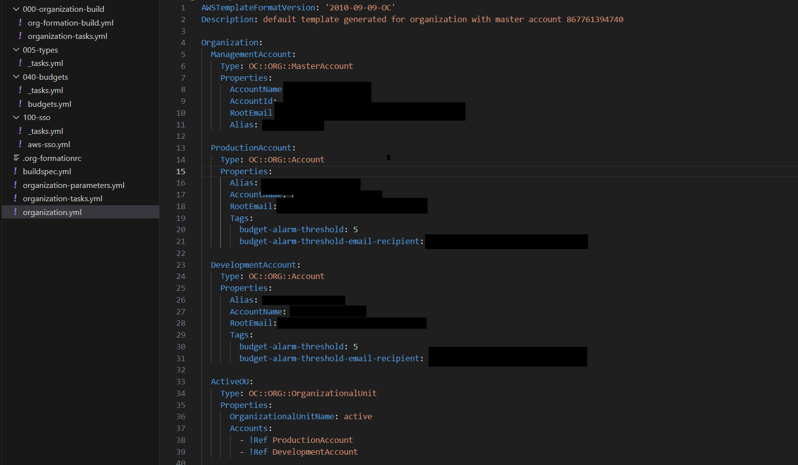
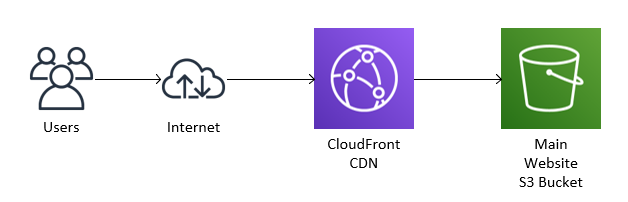
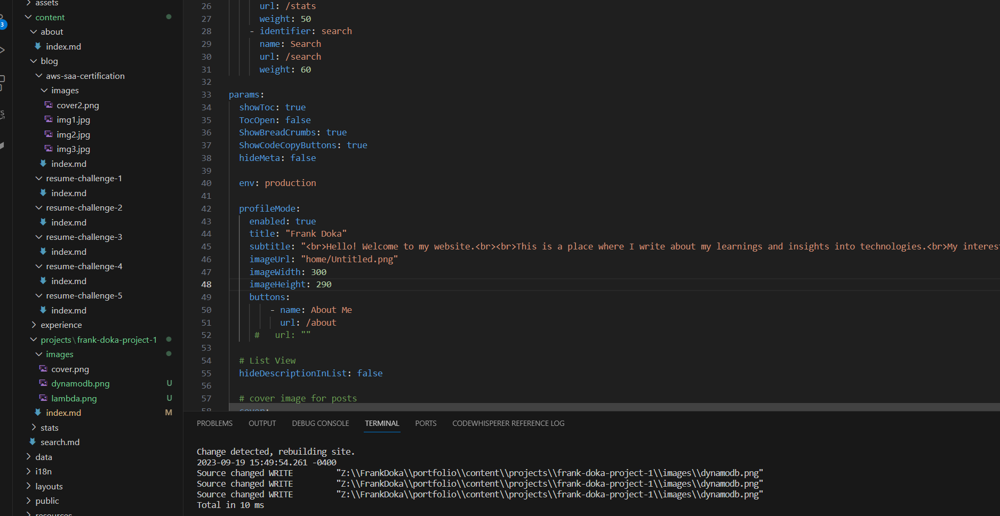
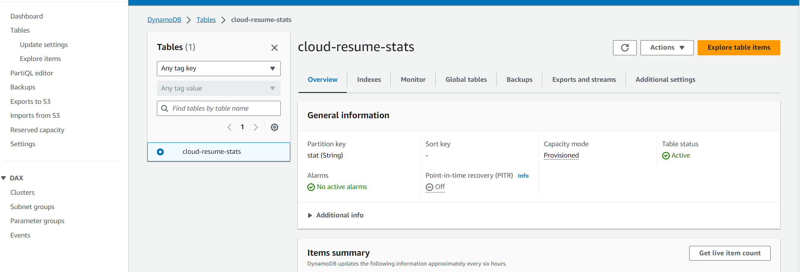
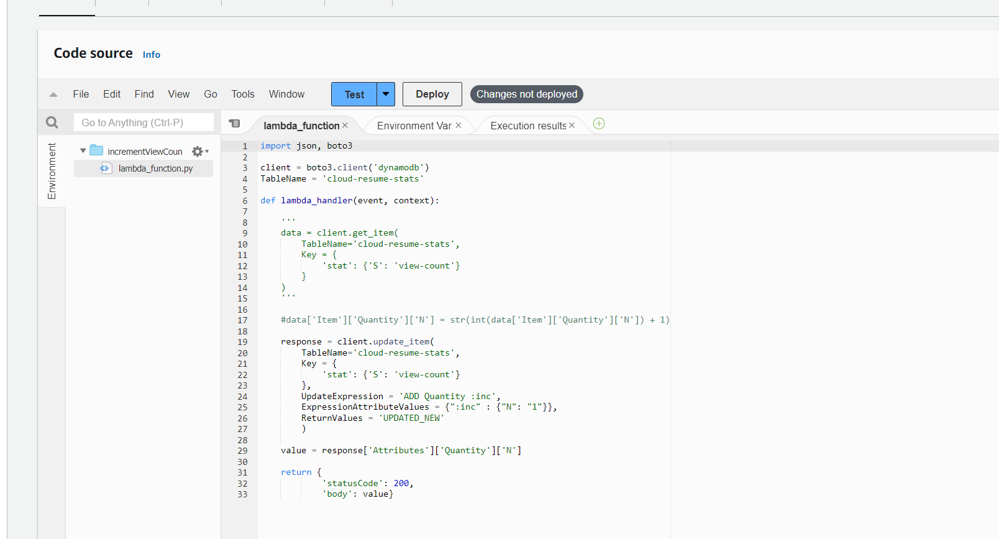
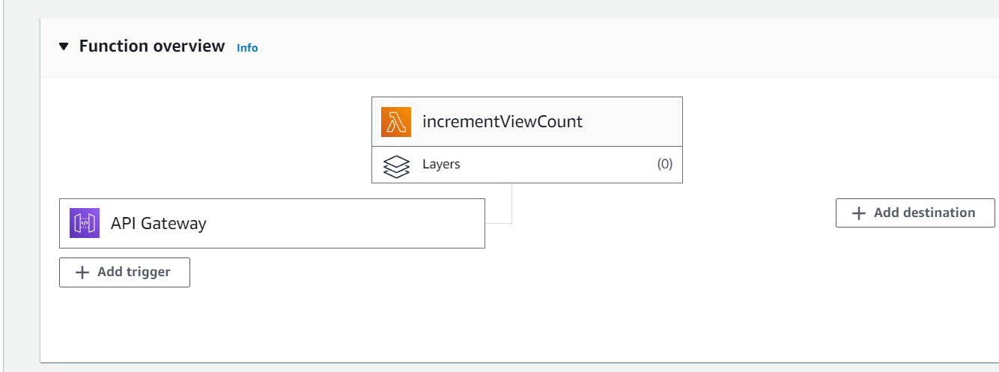
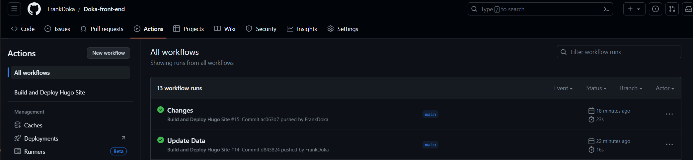

## Intro

The AWS Cloud Resume Challenge is an engaging, hands-on initiative designed to elevate AWS cloud skills. Participants are challenged to build a professional resume website hosted exclusively on AWS infrastructure. This practical project hones the ability to deploy, configure, and secure AWS services, including EC2, S3,Route 53, Lambda, DynamoDB and much more.

It offers an exceptional opportunity to showcase expertise to prospective employers while developing proficiency in cloud computing. Bolster AWS knowledge and create a tangible asset.

## Project Overview
**This is a high-level overview of the steps I took during this challenge:**

1. **HTML Resume:** Start by creating a professional resume using HTML.

2. **CSS Styling:** Style resume using CSS to enhance its visual appeal and formatting.

3. **Static Website:** Host resume on a static S3 website.

4. **HTTPS Security:** Ensure the security of S3 website by enabling HTTPS. Utilize Amazon CloudFront for this purpose.

5. **Custom DNS:** Point a custom DNS name to CloudFront distribution using Amazon Route 53 for a personalized web address.

6. **JavaScript Visitor Counter:** Implement a visitor counter on website using JavaScript to display the number of site visitors.

7. **Database for Visitor Counter:** Use DynamoDB to store and manage the visitor counter data efficiently, benefiting from its on-demand pricing model.

8. **API Creation:** Develop an API that communicates with the database and accepts requests from web app. AWS API Gateway combined with Lambda can help accomplish this.

9. **Python Integration:** Utilize Python for Lambda functions to enhance the functionality of serverless architecture.

10. **Testing:** Implement robust testing for Python code to ensure its reliability and performance.

11. **Infrastructure as Code (IaC):** Configure AWS resources like DynamoDB tables, API Gateway, and Lambda functions using an AWS SAM (Serverless Application Model) template. Deploy these resources effortlessly using AWS SAM CLI.

12. **Source Control:** Employ GitHub for version control, enabling seamless updates to both the backend API and frontend website.

13. **CI/CD (Backend):** Implement GitHub Actions to automate tests and deployments. Whenever updates are pushed to SAM template or Python code, tests are executed, and if successful, the SAM app is packaged and deployed to AWS.

14. **CI/CD (Frontend):** Maintain a separate GitHub repository for website code. Configure GitHub Actions to automatically update the S3 bucket when code changes occur (consider adding logic to invalidate CloudFront cache in code). Avoid committing AWS credentials to your code.

15. **Blog Post Integration:** Include a link to a concise blog post within resume text. This post should highlight key learnings and experiences gained throughout the project.

## Phase 1: Creating AWS Accounts and Organization
Blog Post: [Phase 1](https://frankdoka.com/blog/resume-challenge-1)

Creating the initial AWS master account, production and development accounts. Using tools such as Org-Formations to automate the process for version-control and reusability.

## Phase 2: Building the Website Frontend and Hosting it on AWS
Blog Post: [Phase 2](https://frankdoka.com/blog/resume-challenge-2)

Initial design philosophy - using AWS S3 static website hosting and SSL certificates. Leveraging the use of CloudFront distribution for HTTPS access and global distribution.

Creating the website code using a combination of HTML, CSS, YAML, JSON and HUGO.

## Phase 3: Building the Backend using AWS API Gateway, Lambda Functions, DynamoDB
Blog Post: [Phase 3](https://frankdoka.com/blog/resume-challenge-3)

Building the backend components starting with the database. Storing data on DynamoDB.

Creating lambda function using python to update and return DynamoDB database information.

## Phase 4: Integrating the Frontend and Backend
Blog Post: [Phase 4](https://frankdoka.com/blog/resume-challenge-4)

Integrating website frontend and backend services to create an example visitor counter stat. Creating and linking API Gateway to a lambda function.

## Phase 5: Deployment using IaC and using CI/CD workflows
Blog Post: [Phase 5](https://frankdoka.com/blog/resume-challenge-5)

GitHub Actions Workflow: leveraged GitHub Actions to automate CI/CD pipeline. This streamlined the process of deploying updates, ensuring that SAM application package and Python code were properly tested before deployment.

## Future Plans

Coming from a background in IT infrastructure and working on an on-prem environment for many years, completing this challenge has been eye-opening in a few ways. It's important to adapt to new concepts for working with the cloud. Many design philosophies that I have learned can still be applied in a cloud environment. 

I would like to continue completing more projects to gain more exposure and hands-on experience to the resources and tools that AWS has to offer. I'll be exploring other areas in the cloud.