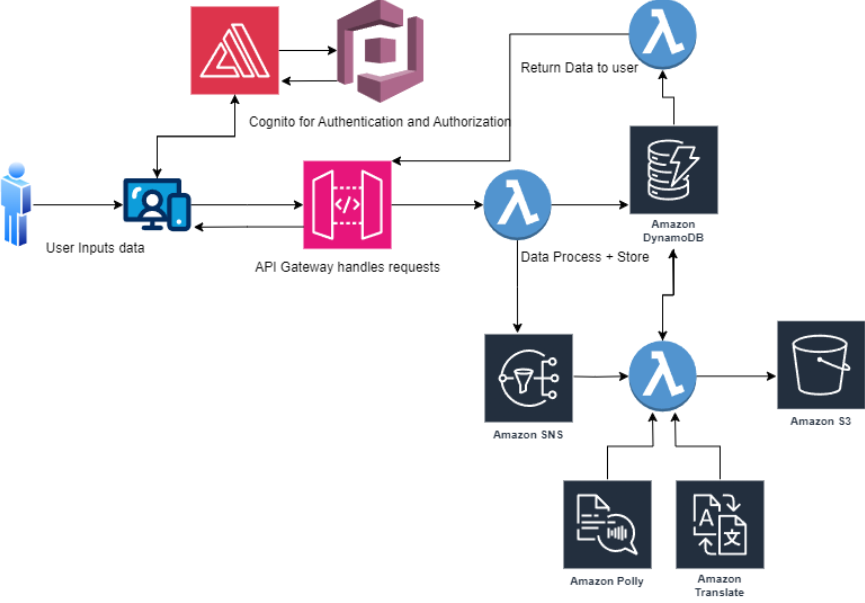
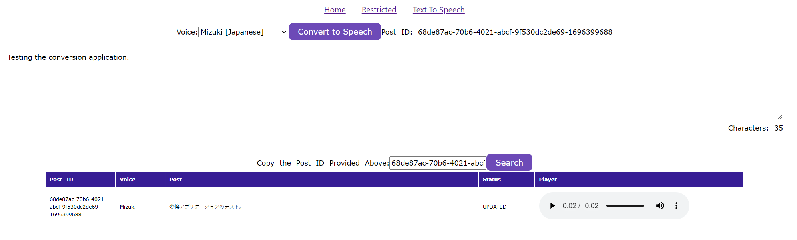

# Text to Speech Translator

## Introduction

As part of my journey to gain hands-on experience with AWS, I decided on a project that integrates various essential AWS services. This project presented multiple challenges and allowed me to explore different areas of AWS.

At a high level, the Text to Speech translator application takes text from a user, uploads it to AWS, and then returns translated text and an audio clip file. The user can choose their desired language from a range of options.

The project is accessible to the public if you create an account on my website. Just click on the "Login" link in the top right corner and register an account.

After registration you can click on the "Text To Speech" link and follow the prompts.

Here is a diagram of the architecture:

Here is a quick view of the frontend of the application:

While the frontend may not be aesthetically pleasing, it is fully functional. I chose to dedicate most of my time to gaining experience with AWS components.

## Project Overview

### AWS Services Utilized

1. **Amazon Cognito**
   - User authentication for website login.
   - Token authentication for API gateway.

2. **AWS Amplify**
   - Integration of frontend components with the backend authentication system.
   - Utilized AWS Amplify Authentication in frontend code.

3. **API Gateway**
   - Creation and management of a REST API for handling POST and GET requests for data transmission.

4. **AWS Lambda**
   - Lambda functions to process and store data received from the API Gateway.
   - Lambda functions for the actual conversion of text.
   - Lambda functions to retrieve processed information and return it to the user.

5. **Amazon DynamoDB**
   - Storage of user-related data, including user ID, text, translation selection, and S3 media location.

6. **Amazon Simple Notification Service (SNS)**
   - Creation of a topic for notifying when a user makes a new entry.
   - A Lambda function is subscribed to process data.

7. **Amazon Translate**
   - Translation of user-provided text to the desired language.

8. **Amazon Polly**
   - Conversion of translated text into a human voice.

9. **Amazon S3**
   - Storage of the audio file in an S3 bucket with an ID corresponding to the user ID and timestamp.

10. **Amazon CloudWatch**
    - Extensive use for creating and viewing log files for different resources to debug errors.

I also made extensive use of IAM to create various users, roles, and policies to ensure proper authentication for the various services used.

For the frontend of the application, I employed React, a versatile component-based framework for creating static and dynamic interfaces with reusable parts. These frontend components also utilized AWS Amplify (which utilizes Amazon Cognito) for user authentication and authorization.

## Project Phases

### Phase 1: Creating Initial Frontend and Login System

[Phase 1](https://frankdoka.com/blog/text-to-speech-1)

- Creation of a Login system frontend UI component using React integrated with AWS Amplify for authorization.
- Implementation of Cognito on the AWS backend.
- Development of a component allowing users to input text, choose a language from a dropdown, and submit the data. There is also a component for the user to retrieve data.

### Phase 2: Initial Serverless Application - Uploading User Input and Database Storage

[Phase 2](https://frankdoka.com/blog/text-to-speech-2)

- Creation of an API Gateway to handle POST requests from the frontend containing text for translation and GET requests for retrieving translated data and audio files.
- Integration of API Gateway with Cognito user pool for JWT token-based authentication.
- Integration of a Lambda function to process incoming data, including text, user ID, language selection, and storage in DynamoDB.
- Notification setup with SNS for new entry notifications.
- Data storage in DynamoDB, including user ID, text, status, and S3 media location.

### Phase 3: Integrating Backend Database with AWS Polly and S3 for Storage of Media Files

[Phase 3](https://frankdoka.com/blog/text-to-speech-3)

- Subscription of a Lambda function to the SNS topic for processing new entries.
- Processing of text conversion by the Lambda function.
- Translation of text using Amazon Translate.
- Invocation of the Amazon Polly API for text-to-speech conversion.
- Storage of the audio file in an S3 bucket organized by user ID and timestamp.
- Update of DynamoDB with the S3 file link.

### Phase 4: Putting It All Together

[Phase 4](https://frankdoka.com/blog/text-to-speech-4)

- Development of a Lambda function to retrieve processed information and return it to the user.
- Modification of the frontend code to accommodate data submission and retrieval.
- Ensuring proper authorization and user-friendly data retrieval.
- Provision of user IDs to users for data retrieval.

### Phase 5: Streamlining with Infrastructure as Code (IaC)

[Phase 5](https://frankdoka.com/blog/text-to-speech-5)

- Terraform Integration: Achieved consistent deployments, minimizing manual configurations and errors.
- Efficient Provisioning: Terraform's modularity allowed for reusable components, achieving cost            efficiencies with on-demand environment provisioning.
- Enhanced Security & Automation: Embedded security practices in configurations and seamlessly integrated Terraform with CI/CD pipelines.

This transition to IaC notably streamlined deployments, bolstered security, and set the stage for scalable future endeavors.

## Final Thoughts

This project has been a fun and insightful journey, providing hands-on experience with AWS services and serverless architecture. It deepened my understanding of cloud development best practices and the power of seamless integration.

Thank you for joining me on this rewarding adventure.
