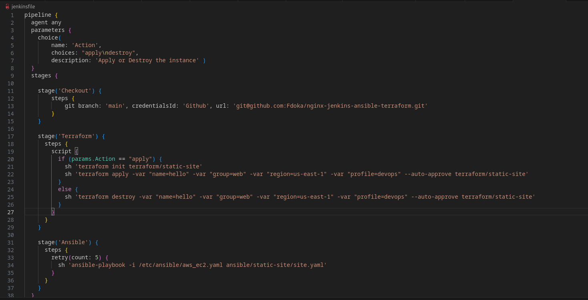
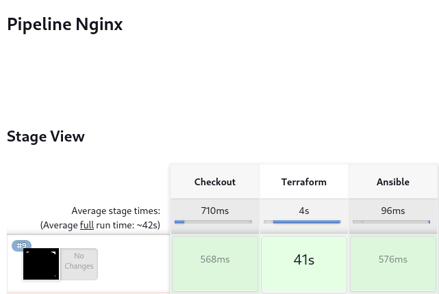

# Jenkins and Its Automation Prowess

Objective: To harness Jenkins for automating the deployment process of our web application on a Docker container hosted in AWS, ensuring a seamless CI/CD pipeline.

## Delving into Jenkins and CI/CD Automation

Jenkins, an open-source automation server, is renowned for its ability to build, test, and deploy code changes, playing a pivotal role in the world of Continuous Integration and Continuous Delivery (CI/CD). By integrating with a myriad of development tools, Jenkins provides a smooth pipeline that streamlines the software delivery process.

1. **Setting Up Jenkins**: Jenkins will be run locally for this project and pulling from Git. 

2. **Creating a Jenkins Pipeline**: A Jenkins pipeline is a series of automated stages that define the steps of the CI/CD process.

3. **Integrating with Ansible**: Use the power of Ansible playbooks within the Jenkins pipeline. This ensures that before the application is deployed, the EC2 instances are appropriately configured.

## Conclusion

Jenkins, when integrated into our CI/CD pipeline, has significantly improved the efficiency and reliability of the deployment process. By automating the steps from code changes to deployment, the web application is consistently updated and aligned with the latest development standards. The synergy between Jenkins and tools like Docker, Ansible, and AWS paves the way for a future where software delivery is both rapid and reliable.
